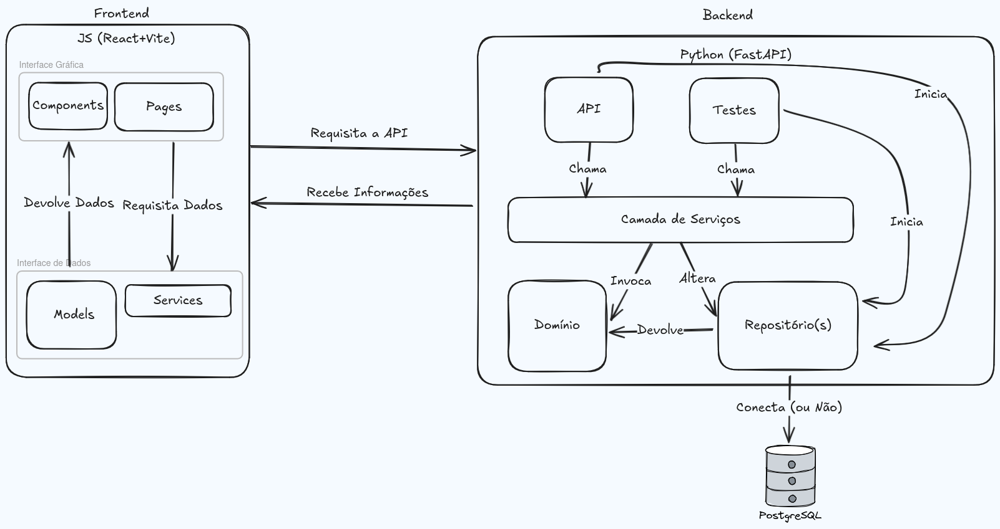

# Projeto Arquitetural do Software

## Histórico de revisões

| Data      | Versão |      Descrição       | Autor       |
| :-------- | :----: | :------------------: | :---------- |
| 3/10/2025 |  1.0   | Criação do Documento | Júlio César |

## Descrição da Arquitetura do Projeto

A arquitetura do KN BarberApp esta organizada em camadas seguindo a ideia de Design Orientado a Domínio(DDD) com a separação de domínios onde os componentes se comunicam e trocam informações via API. O Frontend será em React/Vite.js e Backend em Flask, e PostgreSQL para persistência.

## Visão Geral da Arquitetura

Imagem com a organização geral dos componentes da arquitetura do projeto. Segue um exemplo da **Arquitetura Geral** do projeto:

## Requisitos Não-Funcionais

| Cod.  | Nome                              | Descrição                                                                                         |
| ----- | --------------------------------- | ------------------------------------------------------------------------------------------------- |
| RNF01 | Especificidade de layout          | O software será web e seu layout deverá funcionar tanto em dispositivos móveis quanto em desktop. |
| RNF02 | Permissão de clientes não logados | Clientes não logados no sistema devem ter acesso aos horários e serviços disponíveis.             |
| RNF03 | Limite de Marcação                | Clientes só podem marcar horários com até uma semana de adiantamento.                             |
| RNF04 | Limite de Agendamentos            | Clientes só podem realizar até dois agendamentos por semana                                       |

## Mecanismos arquiteturais

| Mecanismo de Análise | Mecanismo de Design       | Mecanismo de Implementação |
| -------------------- | ------------------------- | -------------------------- |
| Persistência         | Banco de dados relacional | PostgreSQL                 |
| Frontend             | Interface com Componentes | React + Vite.js            |
| Backend              | DDD, TDD e API REST       | Flask (Python)             |
| Build                | Imagem Docker             | Docker e Dockerfile        |
| Deploy               | Container Docker          | Docker compose             |

## Implantação

A implantação do KN BarberApp será dividida em três componentes principais Frontend (React + Vite.js), Backend (Flask, estruturado em camadas de API, serviços, domínio e repositório) e Banco de Dados, se mantendo isolado.

### Frontend

A parte visível aos usuários do sistema está estruturada em quatro principais componentes: _Páginas, Componentes, Modelos e Serviços._

- As **páginas** são as rotas estilizadas visiveis aos clientes do sistema. Essa interface estará separada em dois tipos de visão do sistema: _Barbeiro e Cliente_. A visão do _barbeiro_ é mais abrangente e tem opções que afetam diretametne as opções disponíveis aos _clientes_, já para eles há apenas uma leitura baśica de elementos salvos e poucas possibilidades de alteração.

- Os **componentes** são elementos das páginas que se repetem ao longo da aplicação ou que precisam ser isolados para manter uma lógica específica. São essenciais na construção de aplicações com _react_ pois facilitam a implementação de diferentes estruturas ao longo de diversas páginas, ou então permite que uma mesma estrutura seja o _core_ de diversas outras.

- Os **modelos** são as estruturas de dados que realizam todas as atividades da plataforma. Elas guardam certas informações da _API_ e servem de referência aos clientes ou barbeiros, também podem usadas para _serviços, agendamentos e pagamentos_.

- Os **serviços** são a ponte de comunicação do _frontend_ com o _backend_ através das apis. Essa estrutura que organiza as chamadas e delimita as opções de interferência extera no sistema.

### Backend

Interface de persistência de dados e organização de serviços disponíveis. Segue utilizando o _Domain Driven Design (DDD)_ e _Test Driven Design (TDD)_ juntamente com _API REST_. Utiliza as estruturas de _API, Serviços, Domínio e Repositório_ e uma de _Testes_ para manter a coerência do sistema.

Utilizando do princípio de _inversão de dependências_ o sistema segue desacoplado de diferentes partes, gerando liberdade de produção e facilidade de testes. Essas características proporcionam a implementação de qualquer _API_ no sistema, e a escolhida foi _FastAPI_ devido a sua extrema customização e simples implementação, pois a aplicação é pequena.

- O domínio é a parte responsável pela lógica geral de negócios, é onde os modelos de dados essênciais estão guardados e gerando funções que comunicam as necessidades do _software_. Por exemplo, é nessa parte do sistema que a lógica de _Agendamentos, Jornada de Trabalho e outros fatores essenciais são geradas_.

- O repositório é uma abstração de banco de dados que serve de comunicação de dados com qualquer parte do sistema. Os repositórios são modelados de acordo com as estruturas do sistema. A vantagem do repositório é fornecer uma interface generalizada, ou seja, se for necessário trocar o banco de dados somente essa interface será alterada no sistema.

- Os serviços realizam a comunicação entre _domínio e repositório_ garantindo que suas funções tenham persistência de dados. Eles também são usados quando a lógica envolve múltiplas entidades ou quando a ação não se encaixa naturalmente como um método em uma única classe. Ou seja, ações mais complexas são executadas por serviços. Eles também são a ponte de comunicação entre o sistema e a **API**.

- A camada mais externa do software são as **APIS e Testes**. Pela natureza prática do _DDD_, essa camada (que é a interface do sistema como um todo) pode ser abstraída para diferentes elementos como citado anteriormente, e os testes são um deles.

## Referências

Links utilizados como referência sobre Arquitetura de Software e documentação de Arquiteturas.

- [Cosmic Python](https://www.cosmicpython.com/book/preface.html)
- [Como documentar Arquitetura de Software](http://www.linhadecodigo.com.br/artigo/3343/como-documentar-a-arquitetura-de-software.aspx)
- Peter Eeles; Peter Cripps. The Process of Software Architecting, Addison-Wesley Professional, 2009.
- Paul Clements; Felix Bachmann; Len Bass; David Garlan; James Ivers; Reed Little; Paulo Merson; Robert Nord; Judith Stafford. Documenting Software Architectures: Views and Beyond, Second Edition, Addison-Wesley Professional, 2010.
