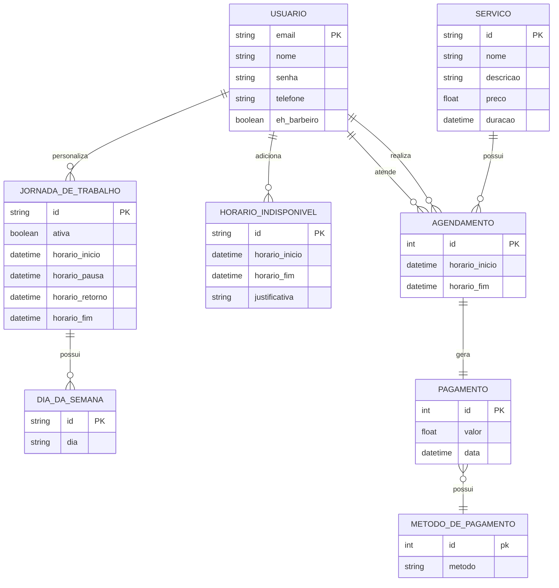

create -> https://github.com/AlecYalcin/KNN-Barber-App/blob/feat/issue14/back/db/create_script.sql

populate -> https://github.com/AlecYalcin/KNN-Barber-App/blob/feat/issue14/back/db/insert_script.sql

