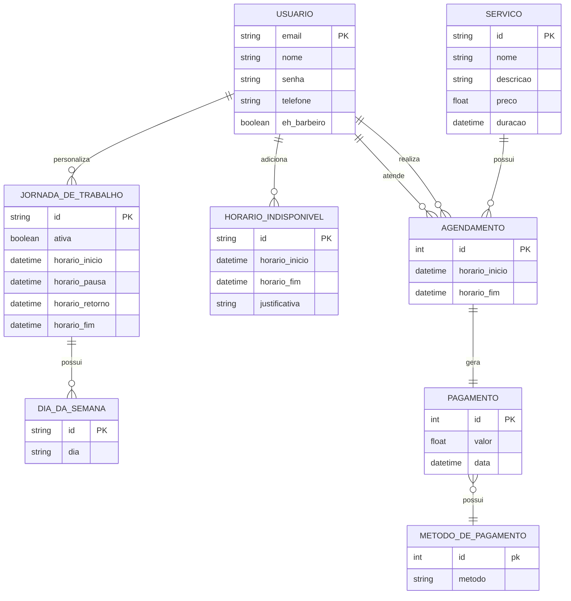

# Contagem de Pontos de Função

A contagem em **Pontos de Função(PF)** permite a determinação do **Tamanho Funcional** do projeto de software. A análise do ponto de função (APF) é um processo para a identificação e contagem das funcionalidades baseadas nos conceitos de _Funções de Dados_ e _Funções de Transação_.

Os conceitos relacionados com dados e relações com operações externas, na fronteira do sistema. Esses conceitos são:

- **Arquivos de Lógica Interna (ALI):** O sistema _controla e grava_
- **Arquivos de Interface Externa (AIE):** O sistema _só lê_
- **Entrada Externa (EE):** O usuário _manda algo_ para o sistema
- **Consulta Externa (CE):** O usuário _pede dados simples_
- **Saída Externa (SE):** O sistema _responde com cálculo ou lógica_

Existem várias técnicas para contagem utilizando esses conhecimentos.

## Contagem Indicativa (CI)

Na contagem indicativa só é necessário analisar os _ALIs_ e _AIEs_, com 35PF e 15PF respectivamente. Essa é uma análise geral e descrompromissada, o ideal é utiliza o documento de _Modelo de Dados_ como base para a análise.

### Modelo de Dados

| Função de Dado    | Entidades Relacionadas | Tamanho em PF |
| ----------------- | ---------------------- | ------------- |
| ALI Usuário       | Usuário                | 35PF          |
| ALI Jornada       | Jornada_de_trabalho    | 35PF          |
| ALI Horário       | Horario_indisponivel   | 35PF          |
| ALI Agendamento   | Agendamento            | 35PF          |
| ALI Serviço       | Servico                | 35PF          |
| ALI Pagamento     | Pagamento              | 35PF          |
| AIE Dia da Semana | Dia_da_semana          | 15PF          |

| Contagem Indicativa | Pontos   |
| ------------------- | -------- |
| **Total**           | 225PF    |
| Ajuste 65%          | 146.25PF |
| Ajuste 135%         | 303.75PF |

## Contagem Detalhada (CD)

Na contagem detalhda é essencial analisar todas as funções de dados, classificando sua complexidade entre baixa, média e alta. Aqui, todos os documentos são passíveis de análise, mas os com maiores informações são o _Modelo de Dados_ e _User Stories_.

Para classificar a complexidade de cada função, o método utilizado verifica os **Dados Elementares Referenciados (DER)** e **Registors Lógicos Referenciados (RLR)**. Os _DERs_ são campos de dados únicos e significativos que a função usa, esse conceito pode estar atrelado a mudança de modelos ou acesso a informações em tabelas. Já os _RLR_ são o conjunto lógico de dados acessados, normalmente associado a tabelas. O _DER_ é contado com cada campo acessado, já o _RLR_ só é contado a partir das tabelas gerais. Por exemplo, uma função pode ter _20 DERs_ mas somente um _RLR_, pois está acessando somente uma tabela, mas realizando 20 operações nela.

### User Stories

---

#### User Story US01 - Gerenciar Conta de Barbeiro

**Descrição:** Como proprietário do sistema, quero ser capaz de atualizar minhas informações pessoais para que meus clientes tenham acesso a dados corretos.

---

#### User Story US02 - Gerenciar Jornada de Trabalho

**Descrição:** Como proprietário do sistema, quero poder alterar minha jornada de trabalho para me adaptar às necessidades do mês, da semana ou do dia.

---

#### User Story US03 - Gerenciar Serviços Ofertados

**Descrição:** Como proprietário do sistema, quero cadastrar e editar os serviços que ofereço, com informações sobre duração e preço.

---

#### User Story US04 - Realizar Agendamentos

**Descrição:** Como cliente do sistema, quero marcar ou desmarcar meus agendamentos com base nos serviços escolhidos e horários disponíveis.

---

#### User Story US05 - Gerenciar Agendamentos

**Descrição:** Como proprietário do sistema, quero visualizar os agendamentos marcados, desmarcar quando necessário e justificar faltas ou emergências.

---

#### User Story US06 - Visualizar Relatório Financeiro

**Descrição:** Como proprietário do sistema, quero visualizar o histórico completo de pagamentos realizados, com detalhes dos usuários e formas de pagamento.

---

#### User Story US07 - Pagamentos do Sistema

**Descrição:** Como Cliente que realizou um agendamento, eu quero ser capaz de ver o valor final, as formas de pagamentos disponíveis e selecionar qual eu desejo.

---

#### User Story US08 - Gerenciar Conta de Cliente

**Descrição:** Como cliente do sistema, quero alterar minhas informações pessoais salvas no sistema.

---

#### User Story US09 - Consultar Histórico de Agendamentos e Pagamentos

**Descrição:** Como usuário do sistema, quero visualizar o histórico de agendamentos realizados e os pagamentos associados a eles.
