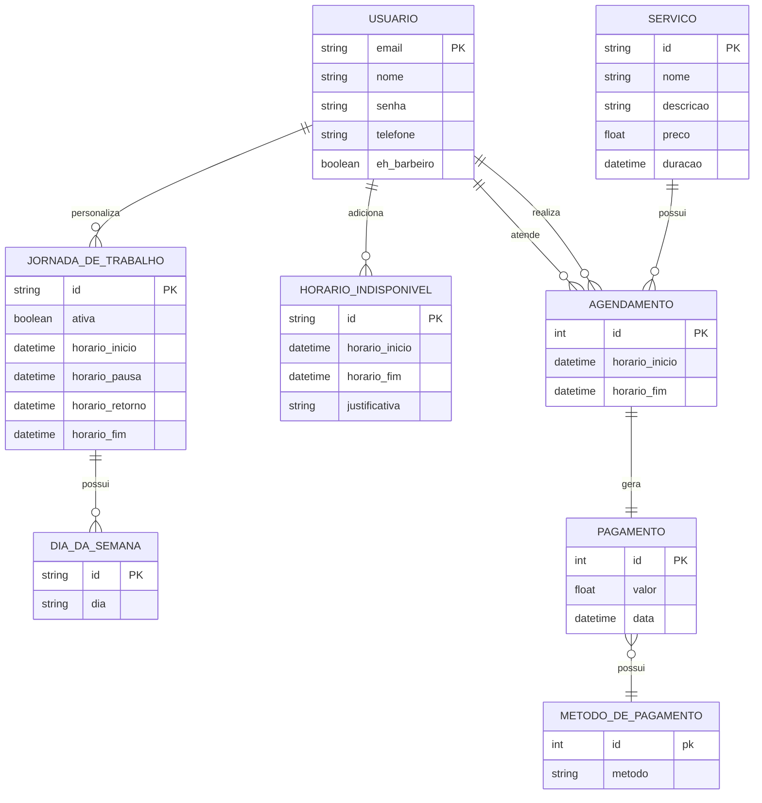

# Contagem de Pontos de Função

A contagem em **Pontos de Função(PF)** permite a determinação do **Tamanho Funcional** do projeto de software. A análise do ponto de função (APF) é um processo para a identificação e contagem das funcionalidades baseadas nos conceitos de _Funções de Dados_ e _Funções de Transação_.

Os conceitos relacionados com dados e relações com operações externas, na fronteira do sistema. Esses conceitos são:

- **Arquivos de Lógica Interna (ALI):** O sistema _controla e grava_
- **Arquivos de Interface Externa (AIE):** O sistema _só lê_
- **Entrada Externa (EE):** O usuário _manda algo_ para o sistema
- **Consulta Externa (CE):** O usuário _pede dados simples_
- **Saída Externa (SE):** O sistema _responde com cálculo ou lógica_

Existem várias técnicas para contagem utilizando esses conhecimentos.

## Contagem Indicativa (CI)

Na contagem indicativa só é necessário analisar os _ALIs_ e _AIEs_, com 35PF e 15PF respectivamente. Essa é uma análise geral e descrompromissada, o ideal é utiliza o documento de _Modelo de Dados_ como base para a análise.

### Modelo de Dados

| Função de Dado          | Entidades Relacionadas | Tamanho em PF |
| ----------------------- | ---------------------- | ------------- |
| ALI Usuário             | Usuário                | 35PF          |
| ALI Jornada             | Jornada_de_trabalho    | 35PF          |
| ALI Horário             | Horario_indisponivel   | 35PF          |
| ALI Agendamento         | Agendamento            | 35PF          |
| ALI Serviço             | Servico                | 35PF          |
| ALI Pagamento           | Pagamento              | 35PF          |
| AIE Dia da Semana       | Dia_da_semana          | 15PF          |
| AIE Metodo de Pagamento | Metodo_de_pagamento    | 15PF          |

| Contagem Indicativa | Pontos |
| ------------------- | ------ |
| **Total**           | 240PF  |
| Ajuste 65%          | 156PF  |
| Ajuste 135%         | 324PF  |

## Contagem Detalhada (CD)

Na contagem detalhda é essencial analisar todas as funções de dados, classificando sua complexidade entre baixa, média e alta. Aqui, todos os documentos são passíveis de análise, mas os com maiores informações são o _Modelo de Dados_ e _User Stories_.

Para classificar a complexidade de cada função, o método utilizado verifica os **Dados Elementares Referenciados (DER)** e **Registors Lógicos Referenciados (RLR)**. Os _DERs_ são campos de dados únicos e significativos que a função usa, esse conceito pode estar atrelado a mudança de modelos ou acesso a informações em tabelas. Já os _RLR_ são o conjunto lógico de dados acessados, normalmente associado a tabelas. O _DER_ é contado com cada campo acessado, já o _RLR_ só é contado a partir das tabelas gerais. Por exemplo, uma função pode ter _20 DERs_ mas somente um _RLR_, pois está acessando somente uma tabela, mas realizando 20 operações nela.

### User Stories

---

#### User Story US01 - Gerenciar Conta de Barbeiro

**Descrição:** Como proprietário do sistema, quero ser capaz de atualizar minhas informações pessoais para que meus clientes tenham acesso a dados corretos.

- **Funcionalidade:** Entrada Externa (EE).
- **MER**: Edição de quatro informações (4).
- **RLR**: A tabela de USUARIO é afetada (1).
- **Complexidade:** 1 RLR / 4 MER em EE (Baixa).

---

#### User Story US02 - Gerenciar Jornada de Trabalho

**Descrição:** Como proprietário do sistema, quero poder alterar minha jornada de trabalho para me adaptar às necessidades do mês, da semana ou do dia.

- **Funcionalidade:** Entrada Externa (EE).
- **MER**: Edição de cinco informações (5).
- **RLR**: A tabela de JORNADA_DE_TRABALHO é afetada (1).
- **Complexidade:** 1 RLR / 5 MER em EE (Baixa).

---

#### User Story US03 - Gerenciar Serviços Ofertados

**Descrição:** Como proprietário do sistema, quero cadastrar e editar os serviços que ofereço, com informações sobre duração e preço.

- **Funcionalidade:** Entrada Externa (EE).
- **MER**: Edição de quatro informações (4).
- **RLR**: A tabela de USUARIO é afetada (1).
- **Complexidade:** 1 RLR / 4 MER em EE (Baixa).

---

#### User Story US04 - Realizar Agendamentos

**Descrição:** Como cliente do sistema, quero marcar ou desmarcar meus agendamentos com base nos serviços escolhidos e horários disponíveis.

Horários Disponíveis:

- **Funcionalidade:** Consulta Externa (CE).
- **MER**: Quatro informações de JORNADA_DE_TRABALHO, três informações de HORARIO_INDISPONIVEL, duas informações de AGENDAMENTO (9).
- **RLR**: As tabelas de AGENDAMENTO, HORARIO_INDISPONIVEL e JORNADA_DE_TRABALHO são acessadas (3).
- **Complexidade:** 3 RLR / 9 MER em CE (Média).

Marcar Agendamento:

- **Funcionalidade:** Entrada Externa (EE).
- **MER**: Cria um novo agendamento com duas informações de AGENDAMENTO, o USUARIO e o SERVICO (4).
- **RLR**: As tabelas USUARIO e SERVICO são acessadas, AGENDAMENTO é afetado. (3)
- **Complexidade:** 3 RLR / 4 MER em EE (Média).

---

#### User Story US05 - Gerenciar Agendamentos

**Descrição:** Como proprietário do sistema, quero visualizar os agendamentos marcados, desmarcar quando necessário e justificar faltas ou emergências.

Visualizar Agendamentos:

- **Funcionalidade:** Consulta Externa (CE).
- **MER**: Visualizar a lista de agendamentos com horario_inicio, horario_fim, usuario e servico (4).
- **RLR**: A tabela de AGENDAMENTO contêm todas as informações. (1)
- **Complexidade:** 1 RLR / 4 MER em CE (Baixa).

Desmarcar Agendamentos:

- **Funcionalidade:** Entrada Externa (EE).
- **MER**: Excluir instância de AGENDAMENTO e criar HORARIO_INDISPONIVEL com os horarios do agendamento e uma justificativa (4).
- **RLR**: As tabelas de AGENDAMENTO e JORNADA_DE_TRABALHO são acessadas (2).
- **Complexidade:** 2 RLR / 4 MER em CE (Baixa).

---

#### User Story US06 - Visualizar Relatório Financeiro

**Descrição:** Como proprietário do sistema, quero visualizar o histórico completo de pagamentos realizados, com detalhes dos usuários e formas de pagamento.

- **Funcionalidade:** Saída Externa (SE).
- **MER**: Lista de PAGAMENTO, Nome do USUARIO, metodo em METODO_DE_PAGAMENTO (3).
- **RLR**: As tabelas de PAGAMENTO, USUARIO e METODO_DE_PAGAMENTO são acessadas. (3).
- **Complexidade:** 3 RLR / 3 MER em CE (Média).

---

#### User Story US07 - Pagamentos do Sistema

**Descrição:** Como Cliente que realizou um agendamento, eu quero ser capaz de ver o valor final, as formas de pagamentos disponíveis e selecionar qual eu desejo.

- **Funcionalidade:** Entrada Externa (EE).
- **MER**: Visualizar os metodos em METODOS_DE_PAGAMENTO, Calcular o valor com o preço dos SERVICOs (2).
- **RLR**: As tabelas de METODOS_DE_PAGAMENTO e SERVICO e acessa (2).
- **Complexidade:** 2 RLR / 2 MER em CE (Baixa).

---

#### User Story US08 - Gerenciar Conta de Cliente

**Descrição:** Como cliente do sistema, quero alterar minhas informações pessoais salvas no sistema.

- **Funcionalidade:** Entrada Externa (EE).
- **MER**: Edição de quatro informações (4).
- **RLR**: A tabela de USUARIO é afetada (1).
- **Complexidade:** 1 RLR / 4 MER em EE (Baixa).

---

#### User Story US09 - Consultar Histórico de Agendamentos e Pagamentos

**Descrição:** Como usuário do sistema, quero visualizar o histórico de agendamentos realizados e os pagamentos associados a eles.

- **Funcionalidade:** Saída Externa (SE).
- **MER**: Lista de PAGAMENTO filtrada por com AGENDAMENTOS com id de usuário, metodo em METODO_DE_PAGAMENTO (3).
- **RLR**: As tabelas de PAGAMENTO, AGENDAMENTOe METODO_DE_PAGAMENTO são acessadas. (3).
- **Complexidade:** 3 RLR / 3 MER em EE (Baixa).

---

### Tabela de Contagem

| Nome da Função                                  | Tipo de Função | Complexidade  | Pontos de Função |
| ----------------------------------------------- | -------------- | ------------- | ---------------- |
| ALI Usuario                                     | ALI            | Baixa         | 7                |
| ALI Servico                                     | ALI            | Baixa         | 7                |
| ALI Jornada de Trabalho                         | ALI            | Baixa         | 7                |
| ALI Horario Indisponivel                        | ALI            | Baixa         | 7                |
| ALI Agendamento                                 | ALI            | Baixa         | 7                |
| ALI Pagamento                                   | ALI            | Baixa         | 7                |
| AIE Dia da Semana                               | AIE            | Baixa         | 5                |
| AIE Metodo de Pagamneto                         | AIE            | Baixa         | 5                |
| Gerenciar Conta de Barbeiro                     | EE             | Baixa         | 3                |
| Gerenciar Jornada de Trabalho                   | EE             | Baixa         | 3                |
| Gerenciar Serviços Ofertados                    | EE             | Baixa         | 3                |
| Realizar Agendamentos                           | CE + EE        | Média + Média | 8                |
| Gerenciar Agendamentos                          | CE + EE        | Baixa + Baixa | 6                |
| Visualizar Relatório Financeiro                 | SE             | Média         | 5                |
| Pagamento do Sistema                            | EE             | Baixa         | 3                |
| Gerenciar Conta do Cliente                      | EE             | Baixa         | 3                |
| Consultar Histórico de Agendamentos e Pagamento | SE             | Baixa         | 4                |

| Contagem Detalhada | Pontos  |
| ------------------ | ------- |
| **Total**          | 90PF    |
| Ajuste 65%         | 58PF    |
| Ajuste 135%        | 121.5PF |
