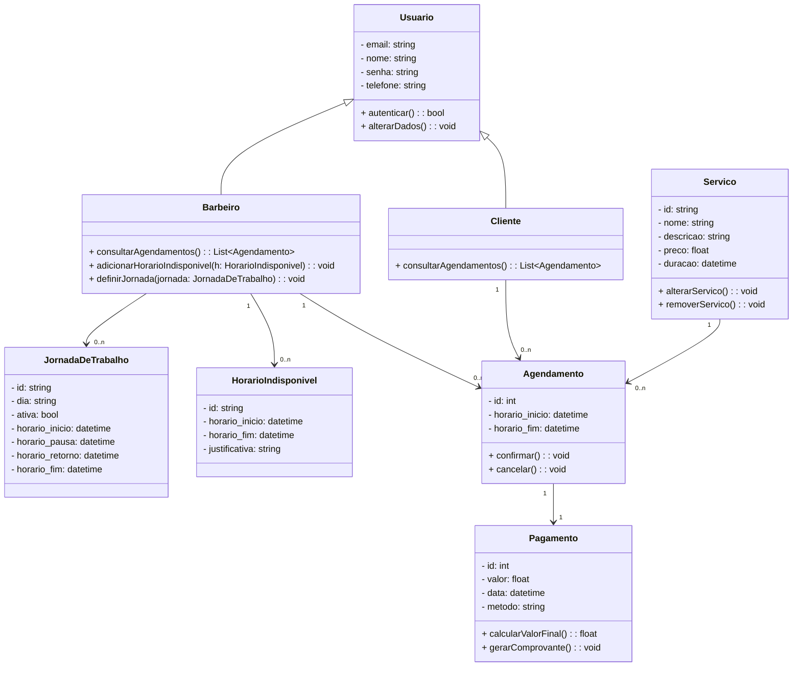
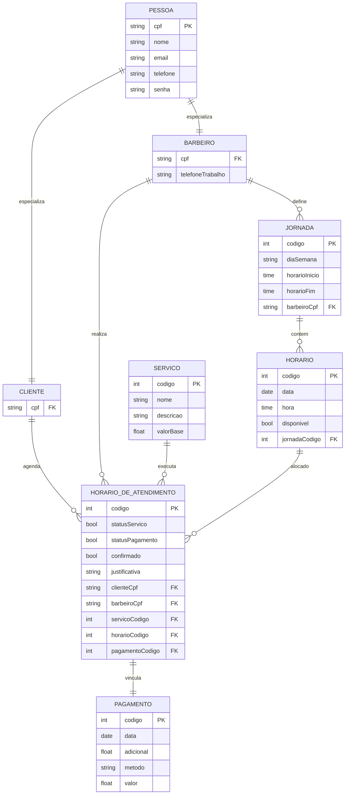

# Documento de Modelos

Neste documento temos o **modelo Conceitual (UML)** e o de **Dados (Entidade-Relacionamento)**. Temos também a **descrição das entidades** e o **dicionário de dados**.

---

## Modelo Conceitual

### Diagrama de Classes usando Mermaid

## Descrição das Entidades

### `Usuario`
Representa qualquer usuário do sistema (cliente ou barbeiro).

- **Atributos:**
  - `email`: string — Endereço de email do usuário.
  - `nome`: string — Nome completo.
  - `senha`: string — Senha de acesso (devidamente criptografada).
  - `telefone`: string — Telefone de contato.

- **Métodos:**
  - `autenticar()`: bool — Verifica se o usuário pode acessar o sistema.
  - `alterarDados()`: void — Permite alterar dados cadastrais.

---

### `Cliente` (herda de `Usuario`)
Usuário que pode realizar agendamentos e consultar histórico de atendimentos.

- **Métodos:**
  - `consultarAgendamentos()`: List<Agendamento> — Lista os agendamentos feitos pelo cliente.

---

### `Barbeiro` (herda de `Usuario`)
Usuário que realiza os atendimentos e define sua agenda.

- **Métodos:**
  - `consultarAgendamentos()`: List<Agendamento> — Lista os agendamentos a serem realizados.
  - `adicionarHorarioIndisponivel(h: HorarioIndisponivel)`: void — Adiciona indisponibilidades específicas.
  - `definirJornada(jornada: JornadaDeTrabalho)`: void — Define ou altera a jornada de trabalho semanal.

---

### `JornadaDeTrabalho`
Define os horários padrão de trabalho do barbeiro.

- **Atributos:**
  - `id`: string
  - `dia`: string — Dia da semana (ex: "Segunda-feira").
  - `ativa`: bool — Se a jornada está ativa.
  - `horario_inicio`: datetime
  - `horario_pausa`: datetime
  - `horario_retorno`: datetime
  - `horario_fim`: datetime

---

### `HorarioIndisponivel`
Define períodos específicos em que o barbeiro não poderá atender.

- **Atributos:**
  - `id`: string
  - `horario_inicio`: datetime
  - `horario_fim`: datetime
  - `justificativa`: string — Motivo da indisponibilidade.

---

### `Servico`
Representa um serviço oferecido pela barbearia.

- **Atributos:**
  - `id`: string
  - `nome`: string
  - `descricao`: string
  - `preco`: float
  - `duracao`: datetime

- **Métodos:**
  - `alterarServico()`: void — Altera os dados do serviço.
  - `removerServico()`: void — Remove o serviço do catálogo.

---

### `Agendamento`
Reúne os dados de um atendimento entre cliente e barbeiro.

- **Atributos:**
  - `id`: int
  - `horario_inicio`: datetime
  - `horario_fim`: datetime

- **Métodos:**
  - `confirmar()`: void — Confirma o agendamento.
  - `cancelar()`: void — Cancela o agendamento.

---

### `Pagamento`
Informações referentes ao pagamento de um agendamento.

- **Atributos:**
  - `id`: int
  - `valor`: float
  - `data`: datetime
  - `metodo`: string — Ex: "Cartão de Crédito", "PIX", "Dinheiro".

- **Métodos:**
  - `calcularValorFinal()`: float — Pode aplicar descontos ou acréscimos.
  - `gerarComprovante()`: void — Gera um recibo ou nota fiscal.
"""

## Modelo de Dados (Entidade-Relacionamento)

## Modelo de Dados (Entidade-Relacionamento)

---

### Dicionário de Dados

---

#### Pessoa

| Tabela     | Pessoa                                                   |
| ---------- | -------------------------------------------------------- |
| Descrição  | Armazena os dados gerais de qualquer usuário do sistema. |
| Observação | Entidade base para clientes e barbeiros.                 |

| Nome do Campo | Descrição do Campo        | Tipo de Dado | Tamanho | Restrições de Domínio  |
| ------------- | ------------------------- | ------------ | ------- | ---------------------- |
| cpf           | Cadastro de Pessoa Física | STRING       | 14      | PK / Not Null / Unique |
| nome          | Nome completo da pessoa   | VARCHAR      | 100     | Not Null               |
| email         | E-mail da pessoa          | VARCHAR      | 150     | Not Null / Unique      |
| telefone      | Telefone de contato       | VARCHAR      | 20      |                        |
| senha         | Senha de acesso           | VARCHAR      | 100     | Not Null               |

---

#### Barbeiro

| Tabela     | Barbeiro                                    |
| ---------- | ------------------------------------------- |
| Descrição  | Armazena dados complementares de barbeiros. |
| Observação | Subclasse da entidade Pessoa.               |

| Nome do Campo | Descrição do Campo   | Tipo de Dado | Tamanho | Restrições de Domínio |
| ------------- | -------------------- | ------------ | ------- | --------------------- |
| cpf           | CPF do barbeiro      | STRING       | 14      | PK / FK / Not Null    |
| tel_trabalho  | Telefone de trabalho | VARCHAR      | 20      |                       |

---

#### Cliente

| Tabela     | Cliente                                     |
| ---------- | ------------------------------------------- |
| Descrição  | Armazena dados complementares de clientes.  |
| Observação | Subclasse da entidade Pessoa.               |

| Nome do Campo | Descrição do Campo  | Tipo de Dado | Tamanho | Restrições de Domínio |
| ------------- | ------------------- | ------------ | ------- | --------------------- |
| cpf           | CPF do cliente      | STRING       | 14      | PK / FK / Not Null    |

---

#### Horario

| Tabela     | Horario                                                 |
| ---------- | ------------------------------------------------------- |
| Descrição  | Armazena datas e horários disponíveis para agendamento. |
| Observação | Utilizado para vincular agendamentos.                   |

| Nome do Campo   | Descrição do Campo       | Tipo de Dado | Tamanho | Restrições de Domínio |
| --------------- | ------------------------ | ------------ | ------- | --------------------- |
| codigo          | Identificador do horário | SERIAL       | ---     | PK                    |
| data            | Data do horário          | DATE         | ---     | Not Null              |
| hora            | Hora do horário          | TIME         | ---     | Not Null              |
| disponibilidade | Se o horário está livre  | BOOLEAN      | ---     | Default: TRUE         |

---

#### Servico

| Tabela     | Servico                                         |
| ---------- | ----------------------------------------------- |
| Descrição  | Armazena os serviços oferecidos pela barbearia. |
| Observação | Usado na marcação de atendimentos.              |

| Nome do Campo | Descrição do Campo       | Tipo de Dado | Tamanho | Restrições de Domínio |
| ------------- | ------------------------ | ------------ | ------- | --------------------- |
| codigo        | Identificador do serviço | SERIAL       | ---     | PK                    |
| nome          | Nome do serviço          | VARCHAR      | 100     | Not Null              |
| descricao     | Descrição do serviço     | VARCHAR      | 250     |                       |
| valorBase     | Valor base               | FLOAT        | ---     | Not Null              |

---

#### Pagamento

| Tabela     | Pagamento                                          |
| ---------- | -------------------------------------------------- |
| Descrição  | Armazena informações financeiras dos atendimentos. |
| Observação | Vinculado a cada horário de atendimento.           |

| Nome do Campo | Descrição do Campo         | Tipo de Dado | Tamanho | Restrições de Domínio |
| ------------- | -------------------------- | ------------ | ------- | --------------------- |
| codigo        | Identificador do pagamento | SERIAL       | ---     | PK                    |
| data          | Data do pagamento          | DATE         | ---     | Not Null              |
| adicional     | Valor adicional aplicado   | FLOAT        | ---     | Default: 0            |
| metodo        | Método de pagamento        | VARCHAR      | 50      |                       |
| valor         | Valor total pago           | FLOAT        | ---     | Not Null              |

---

#### Horario_de_Atendimento

| Tabela     | Horario_de_Atendimento                               |
| ---------- | ---------------------------------------------------- |
| Descrição  | Armazena os agendamentos entre clientes e barbeiros. |
| Observação | Entidade principal de ligação entre as demais.       |

| Nome do Campo   | Descrição do Campo              | Tipo de Dado | Tamanho | Restrições de Domínio |
| --------------- | ------------------------------- | ------------ | ------- | --------------------- |
| codigo          | Identificador do agendamento    | SERIAL       | ---     | PK                    |
| cliente         | CPF do cliente                  | STRING       | 14      | FK / Not Null         |
| barbeiro        | CPF do barbeiro                 | STRING       | 14      | FK / Not Null         |
| servico         | Código do serviço               | INT          | ---     | FK / Not Null         |
| horario         | Código do horário               | INT          | ---     | FK / Not Null         |
| pagamento       | Código do pagamento             | INT          | ---     | FK                    |
| statusServico   | Se o serviço foi realizado      | BOOLEAN      | ---     | Default: FALSE        |
| statusPagamento | Se o pagamento foi realizado    | BOOLEAN      | ---     | Default: FALSE        |
| confirmado      | Se o agendamento foi confirmado | BOOLEAN      | ---     | Default: FALSE        |
| justificativa   | Motivo da recusa, se houver     | VARCHAR      | 250     | Opcional              |
