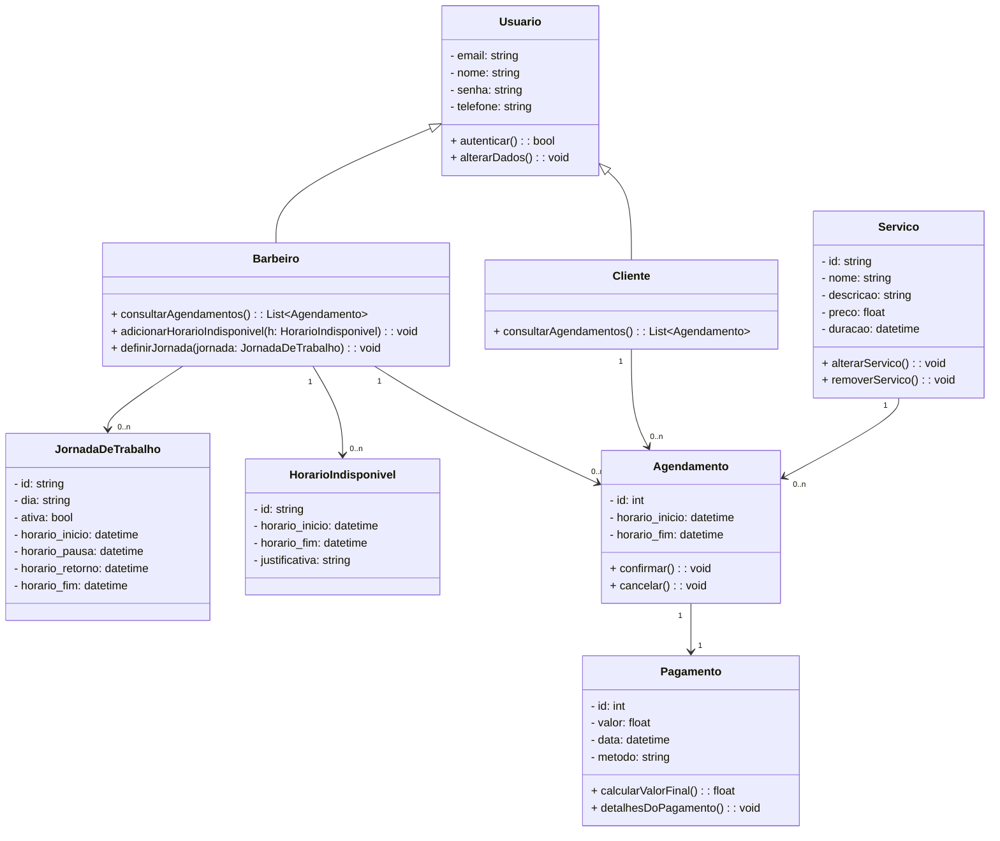
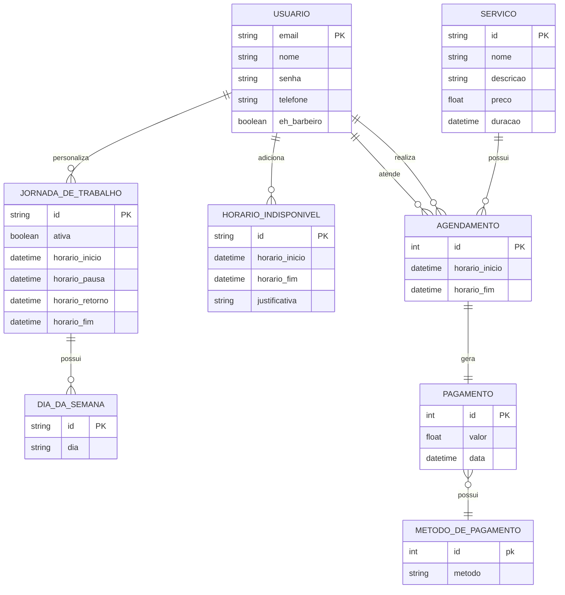

# Documento de Modelos

Neste documento temos o **modelo Conceitual (UML)** e o de **Dados (Entidade-Relacionamento)**. Temos também a **descrição das entidades** e o **dicionário de dados**.

---

## Modelo Conceitual

### Diagrama de Classes usando Mermaid

## Descrição das Entidades

### `Usuario`

Representa qualquer usuário do sistema (cliente ou barbeiro).

- **Atributos:**

  - `email`: string — Endereço de email do usuário.
  - `nome`: string — Nome completo.
  - `senha`: string — Senha de acesso (devidamente criptografada).
  - `telefone`: string — Telefone de contato.

- **Métodos:**
  - `autenticar()`: bool — Verifica se o usuário pode acessar o sistema.
  - `alterarDados()`: void — Permite alterar dados cadastrais.

---

### `Cliente` (herda de `Usuario`)

Usuário que pode realizar agendamentos e consultar histórico de atendimentos.

- **Métodos:**
  - `consultarAgendamentos()`: List<Agendamento> — Lista os agendamentos feitos pelo cliente.

---

### `Barbeiro` (herda de `Usuario`)

Usuário que realiza os atendimentos e define sua agenda.

- **Métodos:**
  - `consultarAgendamentos()`: List<Agendamento> — Lista os agendamentos a serem realizados.
  - `adicionarHorarioIndisponivel(h: HorarioIndisponivel)`: void — Adiciona indisponibilidades específicas.
  - `definirJornada(jornada: JornadaDeTrabalho)`: void — Define ou altera a jornada de trabalho semanal.

---

### `JornadaDeTrabalho`

Define os horários padrão de trabalho do barbeiro.

- **Atributos:**
  - `id`: string
  - `dia`: string — Dia da semana (ex: "Segunda-feira").
  - `ativa`: bool — Se a jornada está ativa.
  - `horario_inicio`: datetime
  - `horario_pausa`: datetime
  - `horario_retorno`: datetime
  - `horario_fim`: datetime

---

### `HorarioIndisponivel`

Define períodos específicos em que o barbeiro não poderá atender.

- **Atributos:**
  - `id`: string
  - `horario_inicio`: datetime
  - `horario_fim`: datetime
  - `justificativa`: string — Motivo da indisponibilidade.

---

### `Servico`

Representa um serviço oferecido pela barbearia.

- **Atributos:**

  - `id`: string
  - `nome`: string
  - `descricao`: string
  - `preco`: float
  - `duracao`: datetime

- **Métodos:**
  - `alterarServico()`: void — Altera os dados do serviço.
  - `removerServico()`: void — Remove o serviço do catálogo.

---

### `Agendamento`

Reúne os dados de um atendimento entre cliente e barbeiro.

- **Atributos:**

  - `id`: int
  - `horario_inicio`: datetime
  - `horario_fim`: datetime

- **Métodos:**
  - `confirmar()`: void — Confirma o agendamento.
  - `cancelar()`: void — Cancela o agendamento.

---

### `Pagamento`

Informações referentes ao pagamento de um agendamento.

- **Atributos:**

  - `id`: int
  - `valor`: float
  - `data`: datetime
  - `metodo`: string — Ex: "Cartão de Crédito", "PIX", "Dinheiro".

- **Métodos:**
  - `calcularValorFinal()`: float — Pode aplicar descontos ou acréscimos.
  - `detalhesDoPagamento()`: void — Texto informativo sobre o pagamento.
    """

## Modelo de Dados (Entidade-Relacionamento)

---

### Dicionário de Dados

---

#### Usuario

| Tabela     | Pessoa                                                   |
| ---------- | -------------------------------------------------------- |
| Descrição  | Armazena os dados gerais de qualquer usuário do sistema. |
| Observação | Entidade base para clientes e barbeiros.                 |

| Nome do Campo | Descrição do Campo                       | Tipo de Dado | Tamanho | Restrições de Domínio  |
| ------------- | ---------------------------------------- | ------------ | ------- | ---------------------- |
| email         | E-mail da pessoa                         | VARCHAR      | 150     | PK / Not Null / Unique |
| nome          | Nome completo da pessoa                  | VARCHAR      | 100     | Not Null               |
| telefone      | Telefone de contato                      | VARCHAR      | 20      |                        |
| senha         | Senha de acesso                          | VARCHAR      | 100     | Not Null               |
| eh_barbeiro   | Identifica usuários com permissão ou não | BOOLEAN      | --      | Default: 0             |

---

#### Jornada de Trabalho

| Tabela     | Horario                                                                                            |
| ---------- | -------------------------------------------------------------------------------------------------- |
| Descrição  | Armazena a jornada de trabalho do usuário barbeiro com o dia, horário de trabalho e se está ativo. |
| Observação | Usada para definir os horários de atendimento do barbeiro                                          |

| Nome do Campo   | Descrição do Campo       | Tipo de Dado | Tamanho | Restrições de Domínio |
| --------------- | ------------------------ | ------------ | ------- | --------------------- |
| codigo          | Identificador da Jornada | SERIAL       | ---     | PK                    |
| ativa           | Jornada atualmente ativa | BOOLEAN      | ---     | Default: 1            |
| horario_inicio  | Início da jornada        | DATETIME     | ---     | Not Null              |
| horario_pausa   | Pausa da jornada         | DATETIME     | ---     | Not Null              |
| horario_retorno | Retorno da jornada       | DATETIME     | ---     | Not Null              |
| horario_fim     | Fim da jornada           | DATETIME     | ---     | Not Null              |
| dia_codigo      | Dia identificado         | INT          | ---     | FK \ Not Null         |

| data | Data do horário | DATE | --- | Not Null |
| hora | Hora do horário | TIME | --- | Not Null |
| disponibilidade | Se o horário está livre | BOOLEAN | --- | Default: TRUE |

#### Dia da Semana

| Tabela     | Horario                                              |
| ---------- | ---------------------------------------------------- |
| Descrição  | Armazena os dias comuns de trabalho                  |
| Observação | Referência para dia da semana na jornada de trabalho |

| Nome do Campo | Descrição do Campo   | Tipo de Dado | Tamanho | Restrições de Domínio |
| ------------- | -------------------- | ------------ | ------- | --------------------- |
| codigo        | Identificador do Dia | SERIAL       | ---     | PK                    |
| dia           | Dia identificado     | STRING       | ---     | Not Null              |

#### Horários Indisponíveis

| Tabela     | Horario                                                                |
| ---------- | ---------------------------------------------------------------------- |
| Descrição  | Armazena horários com início e fim para definir horários indisponíveis |
| Observação | Serve para definir dias indisponíveis, férias e cancelar horários      |

| Nome do Campo  | Descrição do Campo                    | Tipo de Dado | Tamanho | Restrições de Domínio |
| -------------- | ------------------------------------- | ------------ | ------- | --------------------- |
| codigo         | Identificador do Horário Indisponível | SERIAL       | ---     | PK                    |
| horario_inicio | Início do horário restrito            | DATETIME     | ---     | Not Null              |
| horario_fim    | Fim do horário restrito               | DATETIME     | ---     | Not Null              |
| justificativa  | Explicação do horário indisponível    | VARCHAR      | 300     |                       |

---

#### Servico

| Tabela     | Servico                                         |
| ---------- | ----------------------------------------------- |
| Descrição  | Armazena os serviços oferecidos pela barbearia. |
| Observação | Usado na marcação de atendimentos.              |

| Nome do Campo | Descrição do Campo       | Tipo de Dado | Tamanho | Restrições de Domínio |
| ------------- | ------------------------ | ------------ | ------- | --------------------- |
| codigo        | Identificador do serviço | SERIAL       | ---     | PK                    |
| nome          | Nome do serviço          | VARCHAR      | 100     | Not Null              |
| descricao     | Descrição do serviço     | VARCHAR      | 250     |                       |
| valor         | Valor base               | FLOAT        | ---     | Not Null              |

---

#### Pagamento

| Tabela     | Pagamento                                          |
| ---------- | -------------------------------------------------- |
| Descrição  | Armazena informações financeiras dos atendimentos. |
| Observação | Vinculado a cada horário de atendimento.           |

| Nome do Campo | Descrição do Campo           | Tipo de Dado | Tamanho | Restrições de Domínio |
| ------------- | ---------------------------- | ------------ | ------- | --------------------- |
| codigo        | Identificador do pagamento   | SERIAL       | ---     | PK                    |
| data          | Data do pagamento            | DATE         | ---     | Not Null              |
| valor         | Valor total pago             | FLOAT        | ---     | Not Null              |
| metodo_id     | Método de pagamento          | INT          | ---     | FK / Not Null         |
| status        | Se o pagamento foi realizado | BOOLEAN      | ---     | Default: FALSE        |

---

#### Métodos de Pagamento

| Tabela     | Pagamento                                               |
| ---------- | ------------------------------------------------------- |
| Descrição  | Tabela que armazena os métodos de pagamento disponívies |
| Observação | Serve para definir métodos em pagamentos                |

| Nome do Campo | Descrição do Campo                   | Tipo de Dado | Tamanho | Restrições de Domínio |
| ------------- | ------------------------------------ | ------------ | ------- | --------------------- |
| codigo        | Identificador do metodo de pagamento | SERIAL       | ---     | PK                    |
| metodo        | nome do metodo de pagamento          | VARCHAR      | 100     | Not Null              |

---

#### Agendamento

| Tabela     | Horario_de_Atendimento                               |
| ---------- | ---------------------------------------------------- |
| Descrição  | Armazena os agendamentos entre clientes e barbeiros. |
| Observação | Entidade principal de ligação entre as demais.       |

| Nome do Campo    | Descrição do Campo               | Tipo de Dado | Tamanho | Restrições de Domínio |
| ---------------- | -------------------------------- | ------------ | ------- | --------------------- |
| codigo           | Identificador do agendamento     | SERIAL       | ---     | PK                    |
| horario_inicio   | Horário do início do atendimento | DATETIME     | ---     | Not Null              |
| horario_fim      | Horário do fim do atendimento    | DATETIME     | ---     | Not Null              |
| cliente_email    | Email do cliente                 | VARCHAR      | 100     | FK / Not Null         |
| barbeiro_email   | Email do barbeiro                | VARCHAR      | 100     | FK / Not Null         |
| servico_codigo   | Código do serviço                | INT          | ---     | FK / Not Null         |
| pagamento_codigo | Código do pagamento              | INT          | ---     | FK                    |
