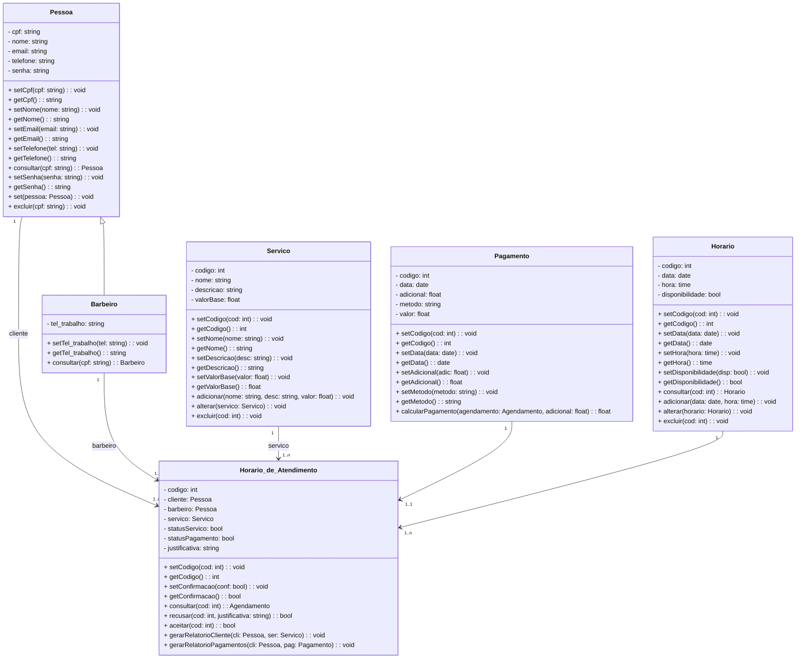

# Documento de Modelos

Neste documento temos o **modelo Conceitual (UML)** e o de **Dados (Entidade-Relacionamento)**. Temos também a **descrição das entidades** e o **dicionário de dados**.

---

## Modelo Conceitual

### Diagrama de Classes usando Mermaid

### Descrição das Entidades

| Entidade               | Descrição                                                                                                                                                                                             |
| ---------------------- | ----------------------------------------------------------------------------------------------------------------------------------------------------------------------------------------------------- |
| Pessoa                 | Entidade abstrata para representar informações gerais das pessoas no sistema: cpf, nome, email, telefone, senha, além de métodos como consultar(), alterar() e excluir().                             |
| Barbeiro               | Entidade que representa um barbeiro. Estende a classe Pessoa e adiciona o atributo tel_trabalho, além de métodos específicos como consultar().                                                        |
| Serviço                | Entidade que representa um serviço oferecido pela barbearia. Possui atributos como codigo, nome, descricao e valorBase, com métodos para alterar, adicionar e excluir.                                |
| Horário de atendimento | Entidade que representa um agendamento entre cliente e barbeiro, incluindo cliente, barbeiro, servico, statusServico, statusPagamento e justificativa, com métodos como recusar() e gerarRelatorio(). |
| Pagamento              | Entidade que representa os dados de pagamento de um agendamento, incluindo codigo, data, adicional, metodo, valor e o método calcularPagamento().                                                     |
| Horário                | Entidade que representa a data e hora de um possível agendamento. Inclui data, hora, disponibilidade e métodos como alocar() e consultar().                                                           |

---

## Modelo de Dados (Entidade-Relacionamento)

---

### Dicionário de Dados

#### Pessoa

| Tabela     | Pessoa                                                   |
| ---------- | -------------------------------------------------------- |
| Descrição  | Armazena os dados gerais de qualquer usuário do sistema. |
| Observação | Entidade base para clientes e barbeiros.                 |

| Nome do Campo | Descrição do Campo        | Tipo de Dado | Tamanho | Restrições de Domínio  |
| ------------- | ------------------------- | ------------ | ------- | ---------------------- |
| cpf           | Cadastro de Pessoa Física | STRING       | 14      | PK / Not Null / Unique |
| nome          | Nome completo da pessoa   | VARCHAR      | 100     | Not Null               |
| email         | E-mail da pessoa          | VARCHAR      | 150     | Not Null / Unique      |
| telefone      | Telefone de contato       | VARCHAR      | 20      |                        |
| senha         | Senha de acesso           | VARCHAR      | 100     | Not Null               |

---

#### Barbeiro

| Tabela     | Barbeiro                                    |
| ---------- | ------------------------------------------- |
| Descrição  | Armazena dados complementares de barbeiros. |
| Observação | Subclasse da entidade Pessoa.               |

| Nome do Campo | Descrição do Campo   | Tipo de Dado | Tamanho | Restrições de Domínio |
| ------------- | -------------------- | ------------ | ------- | --------------------- |
| cpf           | CPF do barbeiro      | STRING       | 14      | PK / FK / Not Null    |
| tel_trabalho  | Telefone de trabalho | VARCHAR      | 20      |                       |

---

#### Horario

| Tabela     | Horario                                                 |
| ---------- | ------------------------------------------------------- |
| Descrição  | Armazena datas e horários disponíveis para agendamento. |
| Observação | Utilizado para vincular agendamentos.                   |

| Nome do Campo   | Descrição do Campo       | Tipo de Dado | Tamanho | Restrições de Domínio |
| --------------- | ------------------------ | ------------ | ------- | --------------------- |
| codigo          | Identificador do horário | SERIAL       | ---     | PK                    |
| data            | Data do horário          | DATE         | ---     | Not Null              |
| hora            | Hora do horário          | TIME         | ---     | Not Null              |
| disponibilidade | Se o horário está livre  | BOOLEAN      | ---     | Default: TRUE         |

---

#### Servico

| Tabela     | Servico                                         |
| ---------- | ----------------------------------------------- |
| Descrição  | Armazena os serviços oferecidos pela barbearia. |
| Observação | Usado na marcação de atendimentos.              |

| Nome do Campo | Descrição do Campo       | Tipo de Dado | Tamanho | Restrições de Domínio |
| ------------- | ------------------------ | ------------ | ------- | --------------------- |
| codigo        | Identificador do serviço | SERIAL       | ---     | PK                    |
| nome          | Nome do serviço          | VARCHAR      | 100     | Not Null              |
| descricao     | Descrição do serviço     | VARCHAR      | 250     |                       |
| valorBase     | Valor base               | FLOAT        | ---     | Not Null              |

---

#### Pagamento

| Tabela     | Pagamento                                          |
| ---------- | -------------------------------------------------- |
| Descrição  | Armazena informações financeiras dos atendimentos. |
| Observação | Vinculado a cada horário de atendimento.           |

| Nome do Campo | Descrição do Campo         | Tipo de Dado | Tamanho | Restrições de Domínio |
| ------------- | -------------------------- | ------------ | ------- | --------------------- |
| codigo        | Identificador do pagamento | SERIAL       | ---     | PK                    |
| data          | Data do pagamento          | DATE         | ---     | Not Null              |
| adicional     | Valor adicional aplicado   | FLOAT        | ---     | Default: 0            |
| metodo        | Método de pagamento        | VARCHAR      | 50      |                       |
| valor         | Valor total pago           | FLOAT        | ---     | Not Null              |

---

#### Horario_de_Atendimento

| Tabela     | Horario_de_Atendimento                               |
| ---------- | ---------------------------------------------------- |
| Descrição  | Armazena os agendamentos entre clientes e barbeiros. |
| Observação | Entidade principal de ligação entre as demais.       |

| Nome do Campo   | Descrição do Campo              | Tipo de Dado | Tamanho | Restrições de Domínio |
| --------------- | ------------------------------- | ------------ | ------- | --------------------- |
| codigo          | Identificador do agendamento    | SERIAL       | ---     | PK                    |
| cliente         | CPF do cliente                  | STRING       | 14      | FK / Not Null         |
| barbeiro        | CPF do barbeiro                 | STRING       | 14      | FK / Not Null         |
| servico         | Código do serviço               | INT          | ---     | FK / Not Null         |
| horario         | Código do horário               | INT          | ---     | FK / Not Null         |
| pagamento       | Código do pagamento             | INT          | ---     | FK                    |
| statusServico   | Se o serviço foi realizado      | BOOLEAN      | ---     | Default: FALSE        |
| statusPagamento | Se o pagamento foi realizado    | BOOLEAN      | ---     | Default: FALSE        |
| confirmado      | Se o agendamento foi confirmado | BOOLEAN      | ---     | Default: FALSE        |
| justificativa   | Motivo da recusa, se houver     | VARCHAR      | 250     | Opcional              |
