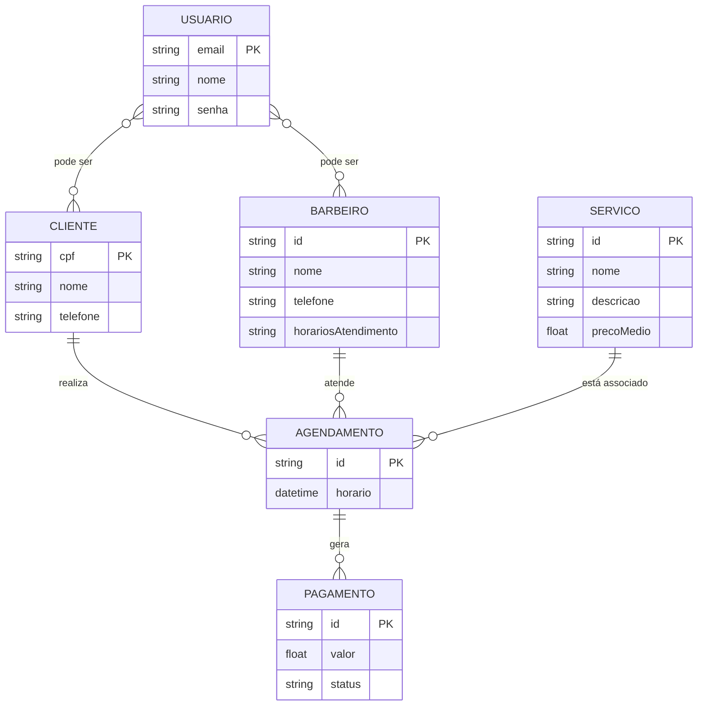

# Documento de Visão

## Descrição do Projeto

O sistema de informação desenvolvido tem como foco ser utilizado pela Barbearia KN, no formato de um aplicativo de agendamento de horários. O software busca acima de tudo trazer a simplicidade para que o usuário, de forma intuitiva, consiga agendar os horários e o tipo de serviço que deseja dentre os oferecidos pela empresa.

Dentro da ideia de agendamento de horários, é importante destacar as funcionalidades principais deste módulo. Além da criação do horário de atendimento com nome e descrição, há a possibilidade de modificar os agendamentos manualmente ou até mesmo desmarcá-los caso haja necessidade. Por fim, os horários seguirão o padrão de Brasília, para evitar conflitos de fuso horário.

Ademais, o software pode ser uma ponte para uma nova forma de controle de pagamentos online, gerando também um relatório de contas referente aos lucros do mês com base em dados de clientes atendidos, assim facilitando a análise dos empresários sobre o empreendimento e as possíveis estratégias futuras.

---

### Histórico de Revisões

| Data       | Versão | Descrição            | Autor           |
| ---------- | ------ | -------------------- | --------------- |
| 02/12/2024 | 1.0    | Criação do Documento | Alec Can Yalcin |
| 02/12/2024 | 1.1    | Definição de Equipe  | Júlio César     |
| 02/12/2024 | 1.2    | Definição dos Riscos | Stênio Eric     |

---

### Equipe e Definição de Papéis

| Equipe             | Papel                   | E-mail                               |
| ------------------ | ----------------------- | ------------------------------------ |
| Alec Can Yalcin    | Gerente, Desenvolvedor  | <alecyalcin@gmail.com>               |
| Denner Bismarck    | Analista, Desenvolvedor | <dennerbismarck@gmail.com>           |
| Júlio César        | Desenvolvedor, Analista | <juliocosta10@gmail.com>             |
| Stênio Eric        | Testador, Analista      | <stenioeric1@gmail.com>              |
| Guilherme Medeiros | Testador, Analista      | <guilherme.medeiros.706@ufrn.edu.br> |

---

### Matriz de Competências

| Equipe             | Competências                                          |
| ------------------ | ----------------------------------------------------- |
| Alec Can Yalcin    | Desenvolvedor full-stack com Laravel, Django e Vue.js |
| Denner Bismarck    | Desenvolvedor back-end com Django, Node.js e PHP      |
| Júlio César        | Desenvolvedor front-end com Django, Vue.js e React    |
| Stênio Eric        | Desenvolvedor front-end com React, Node.js e Tailwind |
| Guilherme Medeiros | Desenvolvedor back-end com Django, Java e PHP         |

---

### Modelo Conceitual

Abaixo apresentamos o modelo conceitual usando o **Mermaid**.

## 3. Descrição Geral

### 3.1 Requisitos Funcionais

| Cod.    | Nome                          | Descrição                                                                                                                          | Categoria |
| ------- | ----------------------------- | ---------------------------------------------------------------------------------------------------------------------------------- | --------- |
| Cod.    | Nome                          | Descrição                                                                                                                          |
| ------- | ----------------------------- | ---------------------------------------------------------------------------                                                        |
| RF01    | Criar Serviço                 | O sistema deve permitir o cadastro de um serviço com Nome, Descrição e Média de preços.                                            |
| RF02    | Listar Serviços               | O sistema deve permitir a visualização de todos os serviços cadastrados e a consulta de um serviço específico.                     |
| RF03    | Atualizar Serviço             | O sistema deve permitir a edição de um serviço, permitindo a alteração de Nome, Descrição e Média de preços.                       |
| RF04    | Remover Serviço               | O sistema deve permitir a exclusão de um serviço cadastrado.                                                                       |
| RF05    | Criar Cliente                 | O sistema deve permitir o cadastro de um cliente com Nome, CPF e Número de contato.                                                |
| RF06    | Listar Clientes               | O sistema deve permitir a visualização de todos os clientes cadastrados e a busca por CPF ou Nome.                                 |
| RF07    | Atualizar Cliente             | O sistema deve permitir a edição dos dados de um cliente (Nome, CPF e Número de contato).                                          |
| RF08    | Remover Cliente               | O sistema deve permitir a exclusão de um cliente cadastrado.                                                                       |
| RF09    | Criar Barbeador               | O sistema deve permitir o cadastro de um barbeador com Nome, Número de contato e Horários de atendimento.                          |
| RF10    | Listar Barbeadores            | O sistema deve permitir a visualização de todos os barbeadores cadastrados e a busca por Nome ou Número.                           |
| RF11    | Atualizar Barbeador           | O sistema deve permitir a edição dos dados de um barbeador (Nome, Número de contato, Horários de atendimento).                     |
| RF12    | Remover Barbeador             | O sistema deve permitir a exclusão de um barbeador cadastrado.                                                                     |
| RF13    | Criar Agendamento             | O sistema deve permitir o cadastro de um agendamento com Horário, Cliente e Serviço.                                               |
| RF14    | Listar Agendamentos           | O sistema deve permitir a visualização de todos os agendamentos cadastrados e a consulta filtrando por Cliente, Barbeador ou Data. |
| RF15    | Atualizar Agendamento         | O sistema deve permitir a alteração dos dados de um agendamento, permitindo o reagendamento do horário, cliente ou serviço.        |
| RF16    | Remover Agendamento           | O sistema deve permitir o cancelamento de um agendamento.                                                                          |
| RF17    | Confirmar Atendimento         | O sistema deve permitir que um barceiro decida se vai aceitar o agendamento ou não.                                                |
| RF18    | Criar Conta de Usuário        | O sistema deve permitir a criação de uma conta de usuário informando Login e Senha.                                                |
| RF19    | Verificar Sessão              | O sistema deve permitir que o usuário verifique seu status de sessão e visualize informações da conta autenticada.                 |
| RF20    | Atualizar Conta de Usuário    | O sistema deve permitir a alteração da senha ou a atualização de informações da conta.                                             |
| RF21    | Remover Conta de Usuário      | O sistema deve permitir a exclusão de uma conta de usuário.                                                                        |
| RF22    | Criar Horário                 | O sistema deve permitir o cadastro de um Horário com Data, Hora e Disponibilidade.                                            |
| RF23    | Listar Horários               | O sistema deve permitir a visualização de todos os Horários cadastrados e a consulta de um Horário específico.                     |
| RF24    | Atualizar Horário             | O sistema deve permitir a edição de um Horário, permitindo a alteração de Data, Hora e Disponibilidade                       |
| RF25    | Remover Horário               | O sistema deve permitir a exclusão de um Horário cadastrado.                                                                       |
| RF22    | Criar Pagamento                 | O sistema deve permitir o cadastro de um Pagamento com Data, Valor, Método e Adicional                                    |
| RF23    | Listar Pagamentos               | O sistema deve permitir a visualização de todos os Pagamentos cadastrados e a consulta de um Pagamento específico.                     |
| RF24    | Atualizar Pagamento             | O sistema deve permitir a edição de um Pagamento, permitindo a alteração de Data, Valor, Método e Adicional                       |
| RF25    | Remover Pagamento               | O sistema deve permitir a exclusão de um Pagamento cadastrado.                                                                       |

### 3.2 Requisitos Não Funcionais

| Cod.  | Nome                              | Descrição                                                                                                                                                              |
| ----- | --------------------------------- | ---------------------------------------------------------------------------------------------------------------------------------------------------------------------- |
| RNF01 | Especificidade de layout          | O software será web e seu layout deverá funcionar tanto em dispositivos móveis quanto em desktop.                                                                      |
| RNF02 | Interface auto explicativa        | Sua interface deverá conter “widgets” com nomes e ícones auto explicativos o suficiente para rápido entendimento.                                                      |
| RNF03 | Interface de uso rápido           | Sua interface, principalmente para o administrador, deverá ser muito bem dividida em cada função, sendo suficiente apertar um ou dois botões para acessar cada tarefa. |
| RNF04 | Permissão de clientes não logados | Clientes não logados no sistema devem poder ter acesso somente aos horários disponíveis.                                                                               |

## 3.3 Perfis de Usuário

| Perfil       | Descrição                                                                                                                                                                                               |
| ------------ | ------------------------------------------------------------------------------------------------------------------------------------------------------------------------------------------------------- |
| **Cliente**  | Usuário que utiliza os serviços do aplicativo. Pode ter diferentes níveis de familiaridade com tecnologia, então a interface deve ser intuitiva e de fácil uso.                                         |
| **Barbeiro** | Atua como administrador da aplicação, podendo gerenciar serviços e acessar dados financeiros. Assim como o cliente, pode ter pouca experiência com tecnologia, então a usabilidade deve ser priorizada. |

---

## 3.4 Riscos

A tabela abaixo apresenta os riscos identificados para o início do projeto. Essa tabela será atualizada ao final de cada iteração na reunião de acompanhamento.

| Data       | Risco                                                             | Prioridade | Responsável   | Status       | Providência/Solução                                                                                             |
| ---------- | ----------------------------------------------------------------- | ---------- | ------------- | ------------ | --------------------------------------------------------------------------------------------------------------- |
| 02/12/2024 | Dificuldade dos usuários em compreender a interface do aplicativo | Alta       | Desenvolvedor | Vigente      | Realizar testes de usabilidade com clientes da barbearia e ajustar a interface com base no feedback.            |
| 02/12/2024 | Relatórios financeiros com dados inconsistentes ou atrasados      | Média      | Desenvolvedor | Não iniciado | Validar a lógica de geração de relatórios e realizar testes com cenários reais de entrada antes da implantação. |
| 02/12/2024 | Resistência dos clientes à adoção do aplicativo                   | Baixa      | Cliente       | Não iniciado | Criar campanhas de conscientização e guias explicativos para os clientes sobre os benefícios do aplicativo.     |

---

## 4. Referências

### Livros e Artigos Acadêmicos

1. PRESSMAN, Roger S. **Engenharia de Software: uma abordagem profissional**. McGraw Hill Brasil, 2016.
2. SOMMERVILLE, Ian. **Engenharia de Software**. Pearson, 2019.
3. KRUG, Steve. **Não me faça pensar: Uma abordagem de bom senso à usabilidade na web e mobile**. Alta Books, 2014.

### Normas e Diretrizes

1. ISO 9241-210:2019. **Ergonomia da interação humano-sistema – Parte 210: Design centrado no ser humano para sistemas interativos**.
2. IEEE 830-1998. **Recommended Practice for Software Requirements Specifications**.

### Artigos e Materiais Online

1. NIELSEN, Jakob. **10 Usability Heuristics for User Interface Design**. Nielsen Norman Group, 1994.  
   Disponível em: [https://www.nngroup.com/articles/ten-usability-heuristics/](https://www.nngroup.com/articles/ten-usability-heuristics/)
2. PREECE, Jenny; ROGERS, Yvonne; SHARP, Helen. **Design de Interação: Além da interação humano-computador**. Bookman, 2013.
