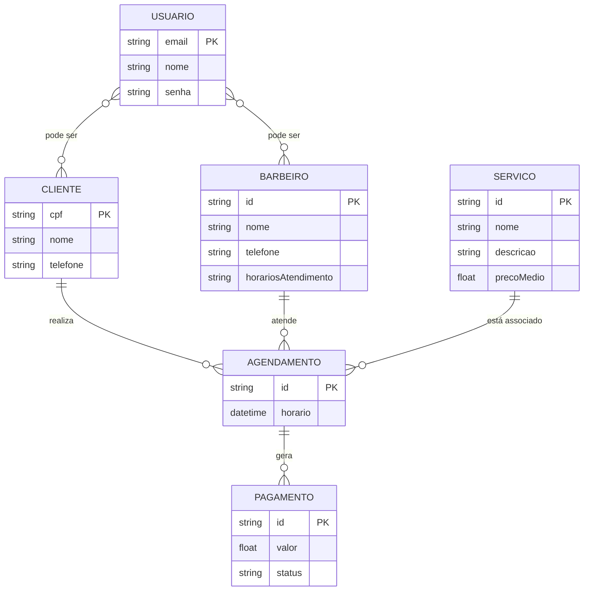

# Documento de Visão

## Descrição do Projeto

O sistema de informação desenvolvido tem como foco ser utilizado pela Barbearia KN, no formato de um aplicativo de agendamento de horários. O software busca acima de tudo trazer a simplicidade para que o usuário, de forma intuitiva, consiga agendar os horários e o tipo de serviço que deseja dentre os oferecidos pela empresa.

Dentro da ideia de agendamento de horários, é importante destacar as funcionalidades principais deste módulo. Além da criação do horário de atendimento com nome e descrição, há a possibilidade de modificar os agendamentos manualmente ou até mesmo desmarcá-los caso haja necessidade. Por fim, os horários seguirão o padrão de Brasília, para evitar conflitos de fuso horário.

Ademais, o software pode ser uma ponte para uma nova forma de controle de pagamentos online, gerando também um relatório de contas referente aos lucros do mês com base em dados de clientes atendidos, assim facilitando a análise dos empresários sobre o empreendimento e as possíveis estratégias futuras.

---

### Histórico de Revisões

| Data       | Versão | Descrição            | Autor           |
| ---------- | ------ | -------------------- | --------------- |
| 02/12/2024 | 1.0    | Criação do Documento | Alec Can Yalcin |
| 02/12/2024 | 1.1    | Definição de Equipe  | Júlio César     |
| 02/12/2024 | 1.2    | Definição dos Riscos | Stênio Eric     |

---

### Equipe e Definição de Papéis

| Equipe             | Papel                   | E-mail                               |
| ------------------ | ----------------------- | ------------------------------------ |
| Alec Can Yalcin    | Gerente, Desenvolvedor  | <alecyalcin@gmail.com>               |
| Denner Bismarck    | Analista, Desenvolvedor | <dennerbismarck@gmail.com>           |
| Júlio César        | Desenvolvedor, Analista | <juliocosta10@gmail.com>             |
| Stênio Eric        | Testador, Analista      | <stenioeric1@gmail.com>              |
| Guilherme Medeiros | Testador, Analista      | <guilherme.medeiros.706@ufrn.edu.br> |

---

### Matriz de Competências

| Equipe             | Competências                                          |
| ------------------ | ----------------------------------------------------- |
| Alec Can Yalcin    | Desenvolvedor full-stack com Laravel, Django e Vue.js |
| Denner Bismarck    | Desenvolvedor back-end com Django, Node.js e PHP      |
| Júlio César        | Desenvolvedor front-end com Django, Vue.js e React    |
| Stênio Eric        | Desenvolvedor front-end com React, Node.js e Tailwind |
| Guilherme Medeiros | Desenvolvedor back-end com Django, Java e PHP         |

---

### Modelo Conceitual

Abaixo apresentamos o modelo conceitual usando o **Mermaid**.

## 3. Descrição Geral

### 3.1 Requisitos Funcionais

| Código | Nome                                 | Descrição                                                                                              |
| ------ | ------------------------------------ | ------------------------------------------------------------------------------------------------------ |
| RF01   | Verificar Sessão                     | Permitir que o usuário verifique seu status de sessão e visualize informações da conta autenticada.    |
| RF02   | Controle de Permissões de Acesso     | Diferenciar as permissões de funcionalidades entre barbeiros e clientes.                               |
| RF03   | Criar Conta de Cliente               | Permitir o cadastro de um cliente com nome, CPF e número de contato.                                   |
| RF04   | Editar Conta de Cliente              | Permitir que o cliente edite suas informações pessoais.                                                |
| RF05   | Remover Conta de Cliente             | Permitir que o cliente exclua sua conta do sistema.                                                    |
| RF06   | Criar Conta de Barbeiro              | Permitir o cadastro de um barbeiro com nome, número de contato e horários de atendimento.              |
| RF07   | Editar Conta de Barbeiro             | Permitir que o barbeiro edite suas informações pessoais.                                               |
| RF08   | Remover Conta de Barbeiro            | Permitir que o barbeiro exclua sua conta do sistema.                                                   |
| RF09   | Listar Barbeiros                     | Permitir a visualização de barbeiros cadastrados, com busca por nome ou número de contato.             |
| RF10   | Cadastrar Serviço                    | Permitir que o barbeiro registre um novo serviço com nome, preço e duração.                            |
| RF11   | Editar Serviço                       | Permitir que o barbeiro atualize dados de um serviço existente.                                        |
| RF12   | Remover Serviço                      | Permitir que o barbeiro exclua um serviço cadastrado.                                                  |
| RF13   | Listar Serviços Disponíveis          | Permitir que o cliente visualize todos os serviços ativos.                                             |
| RF14   | Cadastrar Jornada de Trabalho        | Permitir que o barbeiro defina dias da semana e horários de expediente.                                |
| RF15   | Editar Jornada de Trabalho           | Permitir que o barbeiro edite uma jornada cadastrada.                                                  |
| RF16   | Desativar Jornada                    | Permitir que o barbeiro desligue temporariamente sua jornada de trabalho.                              |
| RF17   | Registrar Horário Indisponível       | Permitir ao barbeiro registrar horários em que estará indisponível, com data, horário e justificativa. |
| RF18   | Editar Horário Indisponível          | Permitir que o barbeiro edite um horário previamente registrado como indisponível.                     |
| RF19   | Remover Horário Indisponível         | Permitir que o barbeiro exclua um horário registrado como indisponível.                                |
| RF20   | Verificar Disponibilidade de Horário | Verificar se o horário está dentro da jornada, não é um horário indisponível e não está ocupado.       |
| RF21   | Selecionar Serviços para Agendamento | Permitir que o cliente selecione um ou mais serviços para o agendamento.                               |
| RF22   | Calcular Duração de Agendamento      | Calcular automaticamente a duração do agendamento com base nos serviços escolhidos.                    |
| RF23   | Realizar Agendamento                 | Permitir que o cliente agende serviços em horários disponíveis.                                        |
| RF24   | Cancelar Agendamento                 | Permitir que o cliente cancele um agendamento existente.                                               |
| RF25   | Bloquear Horário após Agendamento    | Marcar automaticamente como ocupado o horário agendado.                                                |
| RF26   | Exibir Valor de Pagamento            | Exibir ao cliente o valor total do agendamento após a seleção dos serviços.                            |
| RF27   | Informar Forma de Pagamento          | Permitir que o cliente escolha a forma de pagamento no momento do agendamento.                         |
| RF28   | Confirmar Pagamento                  | Permitir que o barbeiro confirme que o pagamento foi realizado.                                        |
| RF29   | Relatório de Pagamentos do Cliente   | Permitir que o cliente veja seus agendamentos e pagamentos passados.                                   |
| RF30   | Relatório de Pagamentos do Barbeiro  | Permitir que o barbeiro veja todos os agendamentos e pagamentos realizados.                            |

### 3.2 Requisitos Não Funcionais

| Cod.  | Nome                              | Descrição                                                                                         |
| ----- | --------------------------------- | ------------------------------------------------------------------------------------------------- |
| RNF01 | Especificidade de layout          | O software será web e seu layout deverá funcionar tanto em dispositivos móveis quanto em desktop. |
| RNF02 | Permissão de clientes não logados | Clientes não logados no sistema devem ter acesso aos horários e serviços disponíveis.             |
| RNF03 | Limite de Marcação                | Clientes só podem marcar horários com até uma semana de adiantamento.                             |
| RNF04 | Limite de Agendamentos            | Clientes só podem realizar até dois agendamentos por semana                                       |

## 3.3 Perfis de Usuário

| Perfil       | Descrição                                                                                     |
| ------------ | --------------------------------------------------------------------------------------------- |
| **Cliente**  | Usuário que utiliza os serviços do aplicativo.                                                |
| **Barbeiro** | Atua como administrador da aplicação, podendo gerenciar serviços e acessar dados financeiros. |

---

## 3.4 Riscos

A tabela abaixo apresenta os riscos identificados para o início do projeto. Essa tabela será atualizada ao final de cada iteração na reunião de acompanhamento.

| Data       | Risco                                                             | Prioridade | Responsável   | Status       | Providência/Solução                                                                                             |
| ---------- | ----------------------------------------------------------------- | ---------- | ------------- | ------------ | --------------------------------------------------------------------------------------------------------------- |
| xx/xx/2025 | Dificuldade dos usuários em compreender a interface do aplicativo | Alta       | Desenvolvedor | Vigente      | Realizar testes de usabilidade com clientes da barbearia e ajustar a interface com base no feedback.            |
| xx/xx/2025 | Relatórios financeiros com dados inconsistentes ou atrasados      | Média      | Desenvolvedor | Não iniciado | Validar a lógica de geração de relatórios e realizar testes com cenários reais de entrada antes da implantação. |
| xx/xx/2025 | Resistência dos clientes à adoção do aplicativo                   | Baixa      | Cliente       | Não iniciado | Criar campanhas de conscientização e guias explicativos para os clientes sobre os benefícios do aplicativo.     |

---

## 4. Referências

### Livros e Artigos Acadêmicos

1. PRESSMAN, Roger S. **Engenharia de Software: uma abordagem profissional**. McGraw Hill Brasil, 2016.
2. SOMMERVILLE, Ian. **Engenharia de Software**. Pearson, 2019.
3. KRUG, Steve. **Não me faça pensar: Uma abordagem de bom senso à usabilidade na web e mobile**. Alta Books, 2014.

### Normas e Diretrizes

1. ISO 9241-210:2019. **Ergonomia da interação humano-sistema – Parte 210: Design centrado no ser humano para sistemas interativos**.
2. IEEE 830-1998. **Recommended Practice for Software Requirements Specifications**.

### Artigos e Materiais Online

1. NIELSEN, Jakob. **10 Usability Heuristics for User Interface Design**. Nielsen Norman Group, 1994.  
   Disponível em: [https://www.nngroup.com/articles/ten-usability-heuristics/](https://www.nngroup.com/articles/ten-usability-heuristics/)
2. PREECE, Jenny; ROGERS, Yvonne; SHARP, Helen. **Design de Interação: Além da interação humano-computador**. Bookman, 2013.
